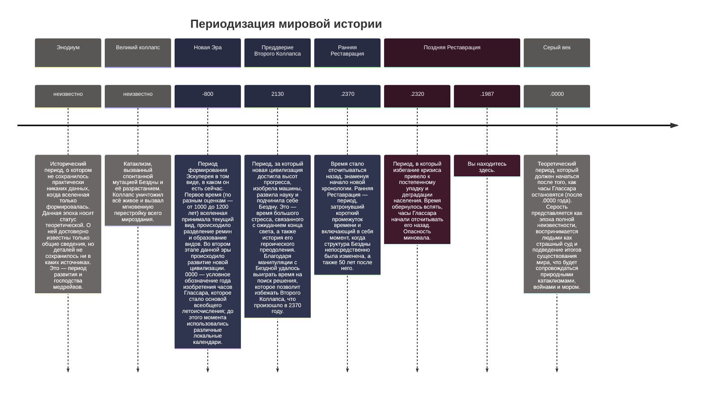

---
tags:
  - история
  - глобальная
Готово: true
Заметка: Финально вычитать
draft: false
---
История Эскуперея делится на периоды (ХХХХ — точка перед датой обозначает год Реставрации). Эти периоды называются Аркейвами. При описании того или иного времени возможно использование как номера, так и названия (I Аркейв/Энодиум, III Аркейв/Новая Эра). 
![[Периодизация истории.canvas]]

Если таймлайн лагает или не открывается, см. альтернативную страницу: [[Периодизация мировой истории]].