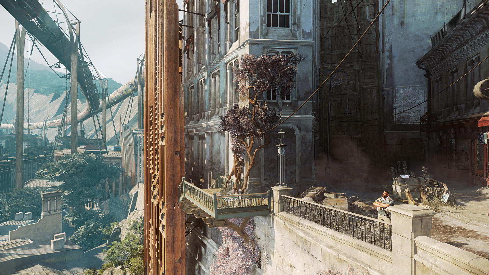
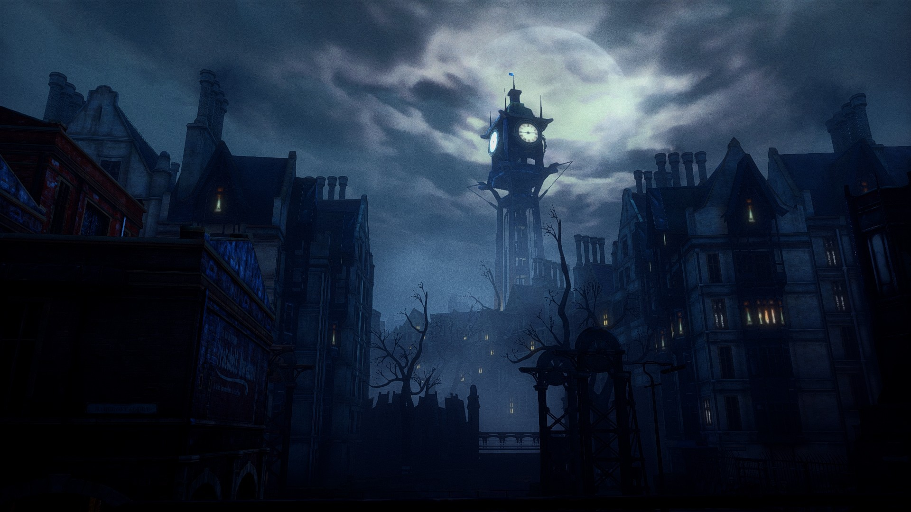

#explorerexclude 

# Облик человечества
Человечество — очень условное понятие, поскольку его составляет множество рас. Самыми распространёнными являются деи (собственно люди), рейроны, салары, эйрали, готала. Все эти расы составляют великое множество народов, обладающих уникальными чертами, необычной культурой и собственной исторической памятью. 
 *Основная статья: [[Общество (черновик)#Культуры|Общество. Культуры]].*  

Несмотря на огромные различия, народы во многом схожи друг с другом и благодаря этому составляют целостную картину того, как выглядит общество. В данный исторический период (VI Аркейв, Эпоха Реставрации) человечество переживает глубокий кризис, связанный с осознанием своего места во вселенной и ответственности за ошибки прошлого. Люди стремятся к синтезу с природой, но не через примитивизм, а через разумную интеграцию. В культуре прочно закрепились концепции биоморфизма, натур-реставрации и эрентицентризма. Это значит, что человечество старается отречься от наследия прошлого, связанного с эпохой господства над Бездной, вернуться к природе и восстановить духовную связь с миром. Часть общества разделяет глубокое и практически религиозное убеждение о том, что Эпоха Знаний нанесла колоссальный ущерб миру и исправление допущенных ошибок целиком и полностью лежит на плечах существ, населяющих Эскуперей, вынужденных расплачиваться за ошибки предков. Другая часть общества предлагает разумный синтез старого и нового без радикального разрыва с прошлым, однако призывает к осторожности. Совсем малая часть не страшится старых технологий и призывает преодолеть страх перед собственным могуществом. С недавних пор все страхи и надежды человечества вращаются вокруг одной глобальной темы — Бездны. Летоисчисление ведётся по часам Глассара, постоянно отсчитывающим её состояние. В Эскуперее сильно развита наука, особенно перспективным направлением является эрентизис (изучение Бездны).  

Важно отметить, что большая часть населения Эскуперея не видит снов (либо не способна их осознать и запомнить). Сновидение доступно лишь избранным и ассоциировано с исключительными эрентургическими способностями, а также представляет огромный интерес для изучения натурфилософами. В некоторых обществах существуют культы сновидений: они включают в себя религиозные практики, где видения считаются посланиями от Бездны. Сновидцы в них почитаются почти как пророки, в то время как в странах, негативно настроенных к эрентургии, сны считаются проявлениями зла. 

Наконец, яркой чертой многих обитателей Эскуперея является нестандартное поведение их собственных [[Тень#4. Тёмное отражение на чём-л., отбрасываемое предметом, освещённым с противоположной стороны (физ.)|теней]]. Учёные продолжают искать этому объяснения, среди них на данный момент самыми состоятельными являются теории о том, что тень воплощает некую "душу" существа, её отсутствие символизирует его оторванность от естества и принадлежность к потустороннему миру (этим объясняется отсутствие теней у [[Скитальцы Бездны (черновик)|Пустотелых]]). Многим людям, особенно эрентургам (но не только им), доступно по-всякому манипулировать своей тенью и в исключительных случаях воздействовать таким образом на материю. 
 
*Подробнее: [[Общество (черновик)|Общество]]*.

## Города

  

  

  

Наведите мышь на изображение, чтобы увидеть его полностью. Нажмите, чтобы открыть картинку полностью.

Текущая эпоха имитирует раннеиндустриальный период. Визуальный образ складывается благодаря фьюжн-дизайну городов и прочих мест обитания людей: в них следы былого технологического величия перемежаются с новыми архитектурными веяниями, призванными восстановить связь человечества с природой. Из-под растений, вьющихся по стенам высотных зданий, костями выпирают очертания застеклённых высотных зданий, окружённые адаптированными под новое время семиэтажными домами в стиле, близком к ар-деко: изящные фасады украшены коваными балконами, увитыми плющом, а дома украшают цветные покатые крыши (чаще всего зелёные). 

Между тем как в центральных районах царит биоморфизм, ближе к окраинам человечество не может полностью искоренить следы своего технологического прошлого: промышленные районы пугают своими грубыми очертаниями, оттенёнными потёками масла и ржавчины. 

Всё ещё можно встретить машины-бреннары, популярные в прошлом, однако их число с каждым годом уменьшается, а такие технологии уступают место конным экипажам и небольшим самоходным аппаратам с двигателями на базе кварц-резонанса. Улицы освещаются фонарями, от которых тянутся к подстанциям мерритовые сети, фабрики используют для работы колебания Бездны. 

*Подробнее: [[Архитектура (черновик)|Архитектура]]*.

# Социальная проблематика
## Борьба человечества за существование

  <blockquote>
    

«Мы играли в богов и это едва нас не уничтожило. Но разве у человечества был иной выбор? Не возьми мы судьбу в свои руки, нас постигла бы участь медрейвов».

— Илатра Легера, <cite>первый энарх Валлакии</cite>

    

  </blockquote>

На протяжении всей истории вселенной человечество несколько раз сталкивалось с угрозой исчезновения. Ранее существовавшая вселенная была стёрта Бездной, пресытившейся образами и знаниями, чтобы на её месте позднее возник Эскуперей — мир незавершённых теней, тлеющих обрывков. Эта же судьба ждала и его, однако человечеству удалось совершить чудо: с помощью Цитадели люди вмешались в саму структуру Бездны и изменили её, обратив время вспять. С того момента она застыла в одном положении. Однако последние известия тревожат научное сообщество: всё яснее с каждым годом тот факт, что Бездна вовсе не стабилизирована, а наступление Второго Коллапса неминуемо. Прежние технологии утеряны: [[Цитадель (черновик)|Цитадель]] исчезла во Мгле, техника вышла из строя, а реальность трещит по швам из-за кризисов Бездны. Менее чем через 200 лет грядет Серая эра — пора, когда время начнет ускоряться, грянут большие бедствия и мир постепенно увянет в ожидании скорой гибели. Эта борьба человечества против самого естества порождает целый комплекс сложных вопросов.

## Эрентургические заигрывания с Бездной — зло или благо?

  <blockquote>
    

 «Изменив Бездну, мы стали подобны богам. Но не развратило ли это род человеческий? Такая власть над самим мирозданием не только помогает выжить в новом мире — она лишает нас человечности и взращивает в нас непомерные амбиции. Слово Синода таково: лучше умереть людьми, чем выжить и стать чудовищами».

— Отец Иларий II, <cite>глава Церкви Белого Кольца, духовный лидер Меретина</cite>

    

  </blockquote>

[[Мистический эрентизис|Эрентургия]] — это кощунственное извращение природы или талант, который может помочь людям? Искусство эрентургии подвергается запрету, и в то же время полностью искоренить его невозможно: после эрентического стазиса число эрентургов в Эскуперее выросло в разы. Наравне с очевидными преимуществами эрентургия может нанести вред как окружающим (в виде разрушений, [[Серебристая пыль (черновик)|серебристой пыли]]), так и самому эрентургу (это, например, сумасшествие и [[Синдром Эзехиля (черновик)|синдром Эзехиля]]). Эрентурги вынуждены скрываться и подавлять в себе любую связь с Бездной, иначе рискуют быть осуждёнными и наказанными. Но как быть тем, кто попросту не способен контролировать себя? Являются ли такие люди злодеями, чьи корыстные и вредительские желания пробудили в них чудовищную силу, или они — лишь жертвы случайной мутации и заложники обстоятельств? Безгрешны ли дети, балующиеся с мистическим эрентизисом, и виновны ли они в появлении серебристой пыли, медленно пожирающей мир? А самое главное — как далеко готовы зайти люди, чтобы сохранить мир и защитить естество от новых искажений?

## Нужно ли избежать Второго Коллапса или следует дать ему наступить?

  <blockquote>
    

«Бессмысленно жить в страхе и вечно бежать от неминуемого — рано или поздно Коллапс настигнет нашу цивилизацию. Мы должны сосредоточиться не на том, как остановить Бездну или предотвратить Коллапс, а на том, как сохранить своё наследие и пережить эту бурю».

— Корр Лестеабаль, <cite>учёный-адаптист</cite>

    

  </blockquote>

Ответ на этот вопрос не так очевиден, как может показаться на первый взгляд. Он занимает научное сообщество лишь на протяжении последнего десятка лет и ещё не вылился во всенародное обсуждение, оставаясь исключительно в пределах академических кругов. Он касается дальнейшей стратегии, как стоит поступить с грядущим Коллапсом: повторить опыт предшественников и ещё раз избежать его или позволить ему произойти, но подготовиться к нему таким образом, чтобы он минимально навредил человечеству. Стратегическая дилемма — недавно поставленная в совре менной философии проблема, подходы к решению которой представлены [[Доктрина Дюраваля (черновик)|доктриной Дюраваля]] (контролизм) и [[Доктрина Белатра (черновик)|доктриной Белатра (адаптизм)]]. 
Однако не все считают Эскуперей вообще достойным сохранения: всё чаще в шуме листвы, вое ветра и бытовых переговорах толпы невнятно звучат бесплотные голоса забытых — тех, кто  желает позволить Бездне поглотить этот мир:  
<b>«ЭСКУПЕРЕЙ БУДЕТ УНИЧТОЖЕН»</b>

## Технологический упадок

  <blockquote>
    

«Даже если бы учёные и парамеханики всего мира объединились, чтобы создать новую Цитадель, они бы не только не добились успеха, но и сгинули бы во Мгле наподобие той, что сейчас окружает Эсгарион. Повторить старые технологии не представляется возможным: серебристая пыль словно магнитом притягивается к любому изобретению, которое пытается воздействовать на Бездну. Мы не идиоты, чтобы просто так отвергать технологии прошлого, которые уже однажды спасли нас от гибели. Но мы не можем восстановить их, потому что в таком случае мы сгинем раньше, чем наступит Второй Коллапс».

— Глеан Лармонт, <cite>ведущий научный сотрудник НИИ проблем эрентизиса Деморвенского университета</cite>

    

  </blockquote>

Специфическая история накладывает на мир свой отпечаток: человечество предпочитает возвращаться к уже известному и знакомому, отвергать прошлые достижения цивилизации. Вмешательство в структуру Бездны не прошло для Эскуперея даром: Цитадель вместе с целым островом [[Эсгарион (черновик)|Эсгарион]] оказалась окружена непроходимой серебристой Мглой; во многих местах образовались пространственные аномалии и разрывы. Повторить старые технологии в новой реальности практически невозможно, поскольку это чревато серьёзными последствиями. 

Кроме того, такому подходу способствует и страх общества перед новыми бедами: люди помнят, что именно технологии Эпохи Знаний привели к всплеску энергии Бездны, появлению эрентургов и всевозможных кризисов. Согласно мнению общественности, восстановление их может как минимум спровоцировать новые нежелательные явления, а как максимум — ускорить наступление Второго Коллапса. 
![[arabesko.ru_04.png]]

# Текущий исторический период — Эпоха Реставрации
**Реставрация стала временем отката к прошлому и тревожной дезориентации в изменившемся мире.** Эрентический стазис не просто помог людям избежать неминуемой гибели в хаосе Второго Коллапса, он также принёс с собой немало бед. Так, например, он вызвал бреши в ткани мира, спровоцировал появление кризисов Бездны и многие локальные катастрофы. Победа над природой не прошла для человечества даром и первые 50 лет ушли именно на стабилизацию после чудовищной встряски. Цитадель вместе со всем островом Эсгарион сгинула во Мгле — необычайно агрессивном и непреодолимом кризисе Бездны, отрезавшем остров от остального мира. Повторить старые технологии в новой реальности практически невозможно: они притягивают серебристую пыль, которая постепенно поглощает пространство, поэтому во многих регионах это запрещено законом. И очень тревожно на этом фоне выглядят последние новости: культурные и природные изменения говорят о том, что Бездна не находится в стабильном состоянии, а лишь отматывается назад. **Теперь человечеству нужно найти способ исправить прошлые ошибки**. У людей есть два возможных пути: стабилизировать Бездну окончательно и не допустить Коллапса, либо позволить ему произойти и постараться сделать этот процесс как можно менее болезненным и разрушительным.
