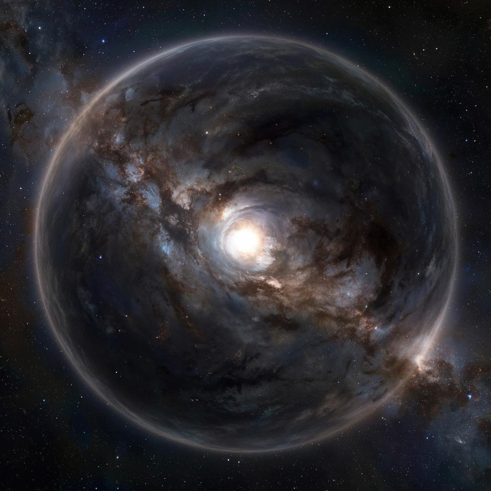

  <blockquote>
    

Наш взгляд обречён на блуждание в мёртвой пустоте неизмеримых пространств.
    
К. Г. Юнг,<cite> «Архетип и символ»</cite>

  </blockquote>

**Ужас перед Бездной** — философская концепция, связанная с комплексом переживаний человека, центром которых является Бездна. Многие специалисты относят к этому комплексу и экзистенциальный ужас, считая оба явления происходящими из одного источника.

  

    <figure>
      
    </figure>
    <figure>
      
    </figure>
    <figure>
      
    </figure>

