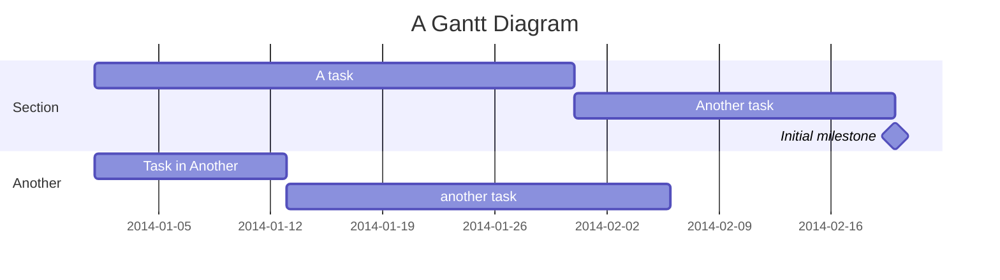

**Эпоха знаний стала временем технологического расцвета в Эскуперее**. Не в последнюю очередь этому способствовала #лакуна какая-то война. Научный прогресс позволил многократно ускорить обмен информацией. За множество лет людям на основе колебаний Бездны и парамеханических изобретений удалось создать как малые подобия ИИ, так и полноценный искусственный интеллект (в 3196 году). Человечество всё ещё было весьма ограничено: преодолеть проблему хрупкости мерритовых систем оказалось нелёгкой задачей, а использовать их для создания каких-либо цифровых технологий оказалось практически невозможно. Учёные видят в этой эпохе золотой век, от которого остались лишь жалкие крупицы технологий; простые же люди считают её временем гордыни, когда человечество «играло в богов».  
В Эру Знаний человечество совершило прорыв в области применения Бездны: учёным удалось стабилизировать ядро вселенной, а благодаря изобретению ИИ человечество смогло предотвратить наступление [[Второй Коллапс|Второго Коллапса]]. Вопреки ожиданиям, он не остановился полностью, а стал отдаляться во времени — состояние Бездны начало "откатываться" назад. 
```table-of-contents
title: **Содержание**
```
# События
```dataview
TABLE WITHOUT ID file.link AS "Событие", годы, масштаб
FROM "Эскуперей/Эскуперей/2. История/История человечества" 
WHERE Эпоха="Эпоха Знаний"
SORT годы
```
# Черты эпохи
## Наука 
- Появление и распространение фундаментальных знаний о Бездне, популяризация её изучения.
- Обнаружение угрозы Второго Коллапса.
- Смещение фокуса внимания в сторону [[Эрентицентризм|эрентицентризма]] — отсчёт времени стал вестись по состоянию Бездны.
- Открытие [[Арне Мареган|Арне Мареганом]] эстратографии и изобретение первой матрицы 

```chronos
- [2314] Описание архетипизации
- [2293] Эстратографии Марегана
- [2137] Открытие дрейфа частиц 
- [2357] Разработка контракционного манёвра
- [2370] Проведение контракционного манёвра
- [2055] Фундаментальные исследования реминисценций
- [2337] Открытие Второго Коллапса
```
## Общество 
## Искусство
## Технологии 
## Политика
## Философия
# Ключевые фигуры эпохи


```dataview
TABLE WITHOUT ID file.link AS "Политики", роль, годы
FROM "Эскуперей/Эскуперей/2. История/z. Известные лица/Политики" 
WHERE Эпоха="Эпоха Знаний"
```
```dataview
TABLE WITHOUT ID file.link AS "Учёные", Деятельность AS "Чем известны", годы, Страна
FROM "Эскуперей/Эскуперей/2. История/z. Известные лица/Учёные" 
WHERE Эпоха="Эпоха Знаний"
```
```dataview
TABLE WITHOUT ID file.link AS "Деятели искусства", Деятельность, годы, Страна
FROM "Эскуперей/Эскуперей/2. История/z. Известные лица/Деятели искусства" 
WHERE Эпоха="Эпоха Знаний"
```
